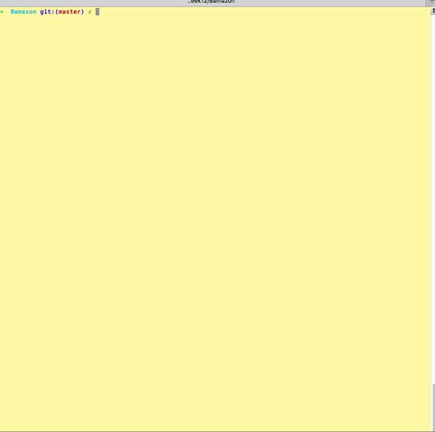

#Bamazon

A Node.js & MySQL command line Amazon-like storefront app that takes in customers orders and depletes stock from the stores Inventory. 

### Overview

#My Videos
[click here to see Bamazon Live!](https://youtu.be/UnZctQ2lnEU) 

## Usage

1. Clone repo
2. npm install
3. cd Bamazon
4. node server.js
5. run it locally. Default Port will be PORT 3000 in any browser.
6. ENJOY! 

## Contributing

1. Fork it!
2. Create your feature branch: `git checkout -b my-new-feature`
3. Commit your changes: `git commit -am 'Add some feature'`
4. Push to the branch: `git push origin my-new-feature`
5. Submit a pull request :D

## Tech Used 

* React 
* Axios 
* Express 
* Mongoose 
* Morgan 
* Webpack 
* React-router 
* Path 
* Express-handlebars 
* Aand many others...

#### Instructions:

### Challenge #1: Customer View (Minimum Requirement)

1. Database is called `Bamazon`.

2. There is a Table inside of that database called `Products`.

3. The products table was created with the following columns.

	* ItemID (unique id for each product)

	* ProductName (Name of product)

	* DepartmentName 

	* Price (cost to customer)

	* StockQuantity (how much of the product is available in stores)

4. I populated the database with 10+ different products. 

5. There is a Node application called `BamazonCustomer.js`. Running this application will first display all of the items available for sale. Include the ids, names, and prices of products for sale.

6. Bamazon then prompts users with two messages. 
	* The first ask them the ID of the product they would like to buy. 
	* The second message should ask how many units of the product they would like to buy.

7. Once an order has been placed the application then checks to see if the store has enough of the product to meet the user's request. 
	* If not, the app will log: `Insufficient quantity!`, and then prevent the order from going through.

8. However, if the store *does* have enough of the product, It will fulfill the users's order. 
	* This means updating the SQL database to reflect the remaining quantity.
	* Once the update goes through, it will show the customer the total cost of their purchase.

---------------------------------

### Manager View 

* There is a new Node application called `BamazonManager.js`. Running this application will:

	* List a set of menu options: 
		* View Products for Sale 
		* View Low Inventory
		* Add to Inventory
		* Add New Product

	* If a manager selects `View Products for Sale`, the app will list every available item: the item IDs, names, prices, and quantities.

	* If a manager selects `View Low Inventory`, it will list all items with a inventory count lower than five.

	* If a manager selects `Add to Inventory`, It will display a prompt that will let the manager "add more" of any item currently in the store. 

	* If a manager selects `Add New Product`, it will allow the manager to add a completely new product to the store.

---------------------------------
## Examples:

### Table View

	| itemID | ProductName | DepartmentName | Price | StockQuantity |
	|--------|-------------|----------------|-------|---------------|
	| 01     | MacBookPro  | Electronics    | 1700  | 1000          |
	| 02     | IpadPro     | Electronics    | 800   | 400           |

